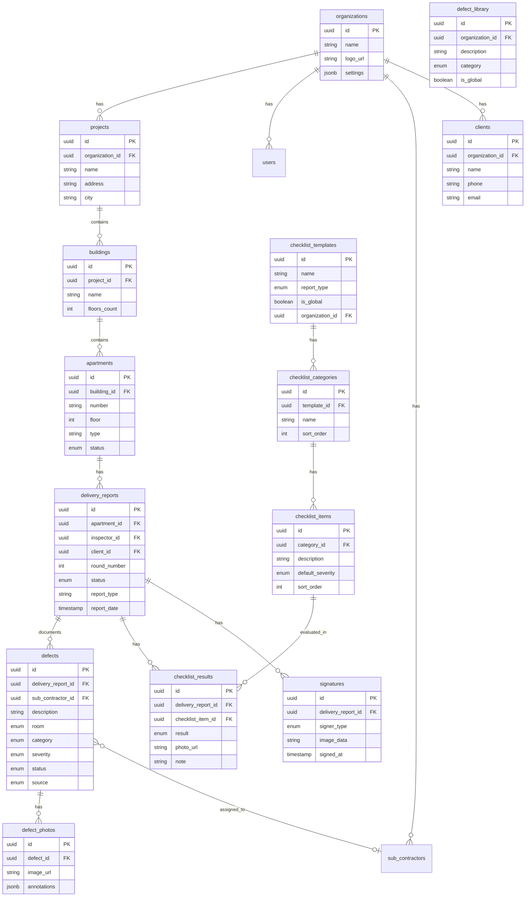

# 📋 PROJECT BRIEF — DocField

> **מסמך זה הוא מקור האמת היחיד של הפרויקט.**
> נוצר לאחר שלב Discovery | מרץ 2026

---

## 1. סקירת המוצר

| שדה | פרטים |
|-------|---------|
| **שם הפרויקט** | DocField |
| **תיאור בשורה** | מערכת דיגיטלית להפקת דוחות מסירה, בדק בית ופיקוח בענף הבנייה — מהשטח ועד ל-PDF |
| **שוק יעד** | ישראל (ראשוני), בינלאומי בהמשך (אנגלית) |
| **קהל יעד** | נציגי קבלני מפתח, מפקחי בנייה עצמאיים, חברות פיקוח וייעוץ הנדסי |
| **בעיה** | דוחות מסירה נעשים היום על נייר ועט או Word/Excel — ליקויים הולכים לאיבוד, אין מעקב תיקונים, תמונות לא מקושרות, חתימות אובדות, אין תמונת מצב כוללת למנהלים |
| **מודל עסקי** | SaaS מנוי חודשי — ניסיון חינם (3 דוחות), בסיסי 99₪/חודש (15 דוחות), מקצועי 199₪/חודש (ללא הגבלה), צוות 349₪/חודש (ללא הגבלה + ריבוי משתמשים) |
| **תאריך התחלה** | מרץ 2026 |
| **יעד MVP** | ייקבע בשלב תכנון טכני |

---

## 2. סטאק טכנולוגי (ממתין לאישור)

> ⬜ **הסטאק ייבחר ויאושר בשלב הבא (Phase 2 — Architecture Design)**
> להלן הכיוון המוקדם בלבד.
>
> ⚠️ **הערה חשובה:** למרות שה-MVP מתמקד בדוח מסירה, הארכיטקטורה חייבת לתמוך מראש בריבוי סוגי דוחות (מסירה, בדק בית, פיקוח, נזילות ועוד) באמצעות Checklist Templates גמישים ו-report_type על כל דוח. אין לבנות מבנה שמוגבל לסוג דוח אחד.

| שכבה | בחירה מוקדמת | הערות |
|-------|--------|---------------|
| Mobile | React Native + Expo | אפליקציית שטח |
| Local DB | WatermelonDB (SQLite) | Offline-first — כל נתון נשמר מיידית |
| Web App | React + Vite + Tailwind | דשבורד ניהול + Web Editor (v1.1) |
| Backend | Supabase | PostgreSQL + Auth + Storage + Realtime + Edge Functions |
| Auth | Supabase Auth | Email/password, אולי OAuth |
| PDF | Puppeteer (Edge Function) | HTML to PDF — שליטה מלאה בעיצוב |
| WhatsApp | Green API | שליחת דוחות + Follow-up (v1.1) |
| AI (v1.1) | Claude API | תמלול הערות קוליות + ניסוח |
| תשלומים (v1.1) | Stripe | מנויים + webhooks |
| Hosting | Vercel (Web) + EAS Build (App) + App Stores | — |
| Monitoring | Sentry | — |

---

## 3. רשימת פיצ'רים (MoSCoW)

### Must Have — MVP (דוח מסירת דירה)

- [ ] **ניהול פרויקטים** — יצירת פרויקט (שם, כתובת, מספר בניינים, דירות)
- [ ] **מבנה היררכי** — פרויקט → בניין → קומה → דירה
- [ ] **טופס מסירה דיגיטלי** — פרטי דירה (פרויקט, בניין, קומה, מספר דירה), פרטי לקוח/דייר
- [ ] **Checklist Engine** — מנוע צ'קליסט חכם לפי סוג דוח ואזור בנכס. לכל פריט: V (תקין) / X (ליקוי) / - (לא רלוונטי). כל X פותח ליקוי אוטומטי עם שדה תמונה + הערה + חומרה. כל V מתועד כ"נבדק ותקין" (ערך ללקוח). תבניות צ'קליסט לפי סוג דוח (מסירה, בדק בית וכו') + אפשרות לבודק להוסיף פריטים אישיים
- [ ] **צ'קליסט לפי חדרים/אזורים** — מטבח, סלון, חדרי שינה, חדרי רחצה, מרפסת, חשמל, טיח, חיצוני, כללי
- [ ] **מאגר ליקויים (Defect Library)** — מאגר גלובלי + אישי של ליקויים מוכרים. חיפוש מהיר + הוספה ידנית חופשית בנוסף לצ'קליסט
- [ ] **צילום תמונות** — צילום ישירות מהאפליקציה, שיוך אוטומטי לליקוי ולחדר
- [ ] **סימון על תמונה** — חצים, עיגולים, טקסט על גבי התמונה לסימון מיקום הליקוי
- [ ] **חומרת ליקוי** — סיווג: קריטי / בינוני / קל
- [ ] **חתימה דיגיטלית** — חתימת נציג קבלן + חתימת דייר על מסך המכשיר
- [ ] **הפקת PDF ממותג** — דוח PDF עם לוגו הקבלן, פרטי דירה, ליקויים + פריטים תקינים, תמונות, חתימות. הפקה באמצעות Puppeteer (HTML to PDF) לשליטה מלאה בעיצוב
- [ ] **עבודה Offline מלאה** — מילוי דוח + צילום תמונות ללא רשת, סנכרון אוטומטי כשיש חיבור
- [ ] **שליחת PDF** — שליחה לדייר (WhatsApp / Email / לינק)
- [ ] **מעקב סבבי מסירה** — מסירה ראשונה → תיקונים → מסירה שנייה → (שלישית)
- [ ] **סטטוס ליקוי** — פתוח / בטיפול / תוקן / לא תוקן
- [ ] **ניהול משתמשים בסיסי** — הרשמה, התחברות, שיוך לחברה/פרויקט

### Should Have — v1.1

- [ ] **Follow-up Flow** — WhatsApp אוטומטי ללקוח אחרי X ימים (ברירת מחדל: 30), צ'קליסט מעקב דיגיטלי (טופל/לא טופל/חלקית), דוח מעקב אוטומטי לשני הצדדים, lead חוזר לבודק כשיש ליקויים פתוחים
- [ ] **Block Editor (Web)** — עריכת דוח בדפדפן: כותרת, טקסט, תמונה, גריד תמונות, טבלת ליקויים. גרירת תמונות, גדלי תמונה שונים (קטן/בינוני/מלא עמוד/גריד), תצוגה מקדימה בזמן אמת
- [ ] **דשבורד מנהל פרויקט** — תמונת מצב כוללת: כמה דירות נמסרו, כמה ליקויים פתוחים, אחוז תיקונים
- [ ] **שיוך ליקויים לקבלני משנה** — חשמלאי, אינסטלטור, טייח, צבעי וכו׳
- [ ] **שליחת PDF/לינק לקבלן משנה** — קבלן משנה מקבל רק את הליקויים הרלוונטיים אליו
- [ ] **דשבורד הנהלת קבלן** — סטטיסטיקות: ליקויים לפי סוג, אחוז תיקון, זמן ממוצע לתיקון
- [ ] **הערות קוליות + AI** — הקלטה קולית בשטח, תמלול אוטומטי (Claude API) לטקסט בדוח
- [ ] **התראות** — תזכורות לתיקון, התראה על דד-ליין
- [ ] **ייצוא נתונים** — Excel/CSV של כל הליקויים

### Could Have — עתיד

- [ ] **דוח בדק בית** — מודול מותאם לבודקי דירות עצמאיים (תבניות צ'קליסט ייעודיות, 7 סוגי דוחות: דירה חדשה, יד שנייה, נזקי שוכר, פיקוח בנייה, איתור נזילות, שטחים ציבוריים, מסחריים)
- [ ] **סימון ליקויים על תוכנית דירה (שרטוט)** — העלאת תוכנית + סימון מיקום ליקויים
- [ ] **דוח פיקוח התקדמות פרויקט** — מעקב שלבי בנייה לפי אחוז ביצוע
- [ ] **אינטגרציה עם ERP של קבלנים** — חיבור למערכות קיימות
- [ ] **AI לזיהוי ליקויים** — זיהוי אוטומטי מתמונות
- [ ] **תמיכה רב-לשונית** — אנגלית, ערבית
- [ ] **API ציבורי** — לחיבור מערכות צד שלישי

### Won't Have — מחוץ לסקופ

- ניהול פיננסי / חשבוניות — לא רלוונטי למוצר
- ניהול לוח זמנים של פרויקט (Gantt) — יש כלים ייעודיים
- שיווק / CRM — לא חלק מהמוצר
- מערכת צ'אט פנימית — WhatsApp כבר קיים

---

## 4. מסעות משתמש (User Journeys)

### מסע 1: נציג קבלן — ביצוע מסירת דירה

```
פותח אפליקציה → בוחר פרויקט ובניין → בוחר דירה →
מתחיל דוח מסירה חדש → בוחר סוג דוח (מסירה) →
המערכת טוענת צ'קליסט מובנה לפי סוג + אזורים →
עובר חדר חדר עם הדייר → לכל פריט: V/X/- →
כל X פותח ליקוי אוטומטי → מצלם + מסמן + מסווג חומרה →
(אפשרות להוסיף ליקויים חופשיים מחוץ לצ'קליסט) →
הדייר חותם → הנציג חותם → מפיק PDF → שולח לדייר →
הדוח נסנכרן לענן
```

### מסע 2: מנהל פרויקט — מעקב סטטוס מסירות

```
נכנס לדשבורד Web → רואה תמונת מצב פרויקט →
סינון: דירות שלא נמסרו / דירות עם ליקויים פתוחים →
נכנס לדירה ספציפית → רואה היסטוריית סבבי מסירה →
משייך ליקויים לקבלני משנה → שולח רשימה לקבלן משנה
```

### מסע 3: סבב שני — מסירה חוזרת

```
נציג פותח דירה קיימת → רואה ליקויים מסבב 1 →
עובר על כל ליקוי: תוקן ✅ / לא תוקן ❌ / ליקוי חדש ➕ →
מצלם ליקויים שלא תוקנו / חדשים → חתימות שני הצדדים →
מפיק PDF מסירה שנייה → שולח לדייר
```

---

## 5. מודל נתונים (High-Level)

### ישויות מרכזיות

| ישות | שדות מרכזיים | קשרים |
|--------|-----------|---------------|
| **Organization** | name, logo, settings | has many Projects, Users, SubContractors |
| **Project** | name, address, city, buildings_count | belongs to Organization, has many Buildings |
| **Building** | name/number, floors_count | belongs to Project, has many Apartments |
| **Apartment** | number, floor, rooms, type, status | belongs to Building, has many DeliveryReports |
| **DeliveryReport** | round_number, status, date, inspector, tenant_name, tenant_phone | belongs to Apartment, has many Defects, ChecklistResults, Signatures |
| **ChecklistTemplate** | name, report_type, is_global, is_custom | has many ChecklistCategories |
| **ChecklistCategory** | name (מקלחון, מטבח, חשמל...), sort_order | belongs to Template, has many ChecklistItems |
| **ChecklistItem** | description, default_severity | belongs to Category |
| **ChecklistResult** | result (pass/fail/na), photo_url, note | belongs to DeliveryReport + ChecklistItem |
| **Defect** | description, room, category, severity, status, source (checklist/manual) | belongs to DeliveryReport, may link to SubContractor |
| **DefectLibrary** | description, category, is_global, is_custom | searchable defect catalog |
| **DefectPhoto** | image_url, annotations | belongs to Defect |
| **Signature** | type (inspector/tenant), image_data, signed_at | belongs to DeliveryReport |
| **SubContractor** | name, trade, phone, email | belongs to Organization, linked to Defects |
| **Client** | name, phone, email, address | belongs to Organization, linked to Reports |
| **User** | email, name, role, organization_id | belongs to Organization |

### ERD (Mermaid)



---

## 6. אינטגרציות צד שלישי

| שירות | מטרה | עדיפות |
|---------|---------|----------|
| Supabase Storage | אחסון תמונות ליקויים | MVP |
| Green API (WhatsApp) | שליחת PDF לדיירים + Follow-up (v1.1) | MVP (שליחה), v1.1 (Follow-up) |
| Puppeteer | הפקת PDF ממותג (HTML to PDF) | MVP |
| Stripe | מנויים + תשלומים | v1.1 |
| Claude API | תמלול הערות קוליות + ניסוח | v1.1 |
| Push Notifications | התראות על ליקויים / תזכורות | v1.1 |
| Supabase Cron | תזמון Follow-up אוטומטי | v1.1 |

---

## 7. שיקולי אבטחה

| חשש | מענה |
|---------|-----------|
| הפרדת שוכרים (Multi-tenant) | RLS על כל טבלה, business_id בכל שורה |
| תמונות רגישות (פרטיות דיירים) | Storage buckets עם הרשאות לפי organization |
| חתימות דיגיטליות | אחסון מאובטח, לא ניתן לשינוי לאחר חתימה |
| עבודה Offline | נתונים מוצפנים על המכשיר, סנכרון מאובטח |
| הרשאות משתמשים | Role-based: admin, project_manager, inspector |
| גישת קבלני משנה | לינק מוגבל לליקויים הרלוונטיים בלבד |

---

## 8. אומדן עלויות

| שירות | עלות חודשית | הערות |
|---------|-------------|-------|
| Supabase | $25 | Pro — 8GB DB, 100GB Storage |
| Vercel | $20 | Pro — דשבורד Web |
| Storage נוסף | $0-25 | תלוי בכמות תמונות |
| Sentry | $0-26 | Free tier בהתחלה |
| Domain | ~$15/שנה | docfield.app / .io |
| Apple Developer | $99/שנה | App Store |
| Google Play | $25 חד-פעמי | Play Store |
| **סה״כ (MVP)** | **~$50-75/חודש** | + עלויות App Store שנתיות |

---

## 9. לוח זמנים (משוער)

| שלב | משך | הערות |
|-------|----------|-------------|
| Architecture & Setup | 1-2 שבועות | בחירת סטאק סופית, הגדרת פרויקט |
| תשתית + Auth + Offline | 2-3 שבועות | הבסיס הטכני הכבד ביותר |
| מודול מסירה — טפסים וצ'קליסט | 2-3 שבועות | הליבה של המוצר |
| צילום + סימון + חתימות | 1-2 שבועות | |
| הפקת PDF | 1-2 שבועות | |
| דשבורד Web בסיסי | 1-2 שבועות | |
| QA & Security Audit | 1 שבוע | |
| Dogfooding + תיקונים | 2 שבועות | חיים משתמש בשטח |
| **סה״כ MVP משוער** | **~10-15 שבועות** | |

---

## 10. סיכונים

| סיכון | סבירות | השפעה | מענה |
|------|-----------|--------|-----------|
| Offline sync מורכב מהצפוי | גבוה | גבוה | בחירת טכנולוגיה מוכחת, POC מוקדם |
| כמות תמונות גדולה = עלויות אחסון | בינוני | בינוני | דחיסת תמונות, מחיקה אוטומטית של ישנות |
| אימוץ איטי ע״י קבלנים | בינוני | גבוה | Dogfooding, התאמה לצרכים אמיתיים |
| ביצועי App על מכשירים ישנים | בינוני | בינוני | בדיקות על מכשירים שונים, אופטימיזציה |
| תחרות ממערכות קיימות (Reporto ואחרות) | בינוני | בינוני | בידול: Offline מלא, UX מותאם לישראל, מחיר |

---

## אישורים

| פריט | סטטוס | תאריך |
|------|--------|------|
| Product Brief | ✅ מאושר | 22/03/2026 |
| Tech Stack | ✅ מאושר (TypeScript + React Native + Expo) | 22/03/2026 |
| Architecture | ⬜ ממתין (Phase 2 — עכשיו) | — |
| Security Plan | ⬜ ממתין (שלב הבא) | — |
| Timeline | ⬜ ממתין (שלב הבא) | — |

---

*מסמך פרויקט לפי MASTER_INSTRUCTIONS.md | נוצר: מרץ 2026*
